作为一个积极与（xiang）世（kan）界（tuo）接（yi）轨（wu）的大好青年，科学上网姿势一定要到位。与其花大价钱去租买各种代理软件，时不时还面临被封IP血本无归的风险，**何不自己租一台境外server搭建自己的服务呢**？毕竟我等工科屌丝动手撸的能力还是阔以的。

搭建一台科学上网server，提起里很麻烦，其实不然，跟着教程，准备一点money（毕竟免费无好货），terminal下一阵操作复制粘贴，就大功告成。具体为以下几步：
<!-- more -->

----
1. 购买Vultr服务器
1.1 注册
1.2 新建服务器
2. 在服务器上安装shadowsocks服务
2.1 远程连接服务器
2.2 安装服务
3. 本地安装shadowsocks管理软件
3.1 下载shadowsocks
3.2 配置服务器
3.3 开启BBR加速
4. 多用户管理
5. IP被封怎么办——服务器快照迁移
5.1 生成快照
5.2 新建服务器
----
OK，我们一步一步来。

## 1. 购买Vultr服务器

境外服务器提供商很多，但是很多都需要按包年或者包月计算，IP被封要重新开通，再次收费。

在这里推荐Vultr，最低$2.5每月，按小时计费，IP被封后只需要destroy原来的server，迁移到新server就行，不需额外收费。
> 需要注意的是：
> - 如果server不被destroy（而只是shut down的话），Vultr会一直扣费。
> - Vultr提供快照功能，迁移服务器非常方便。

### 1.1 注册
[点我注册有优惠](https://www.vultr.com/?ref=7376052)

<a href="https://www.vultr.com/?ref=7376052"></a>

> - 2018年新良心活动：[新用户充10刀送25刀,Twitter分享再领3刀](https://www.vultr.com/promo25b?service=promo25b)，租个每个月$2.5的服务器，够用一年了都：）

> - 这个活动貌似只支持信用卡、paypal、比特币付费。平时注册是支持支付宝的。不过这年头谁还没个信用卡呢：）

服务器配置：

Vultr按小时来计费，比如服务器是5美元1个月，那么每小时收费为5/30/24=0.0069美元 会自动从账号中扣费，只要保证账号有钱即可。**server不被destroy就会一直扣费。**

Vultr提供的服务器配置包括：

2.5美元/月的服务器配置信息：单核 512M内存 20G SSD硬盘 100M带宽 500G流量/月
5美元/月的服务器配置信息：单核 1G内存 25G SSD硬盘 100M带宽 1000G流量/月
10美元/月的服务器配置信息：单核 2G内存 40G SSD硬盘 100M带宽 2000G流量/月
20美元/月...还是不写了，反正我等穷比超过10刀的活动会不会做，大家心里还是有点B树的。
### 1.2 新建服务器
完全傻瓜式操作

1. 点击右上角的“Deploy now”
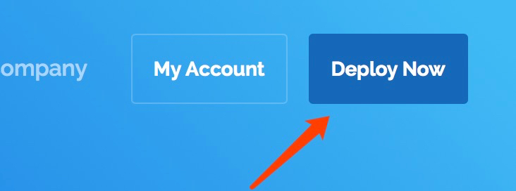

2. 选择哪个国家的服务器
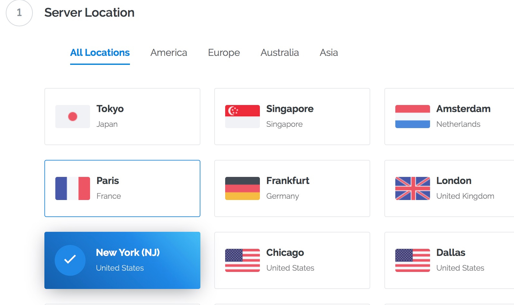
[官方测速地址](https://www.vultr.com/faq/#downloadspeedtests)
亲测ping 东京（60ms）和新加坡(90ms)最快，所以我选最便宜的**纽约服务器**（230ms，现在$2.5的只剩**纽约和迈阿密了**）
3. 装系统
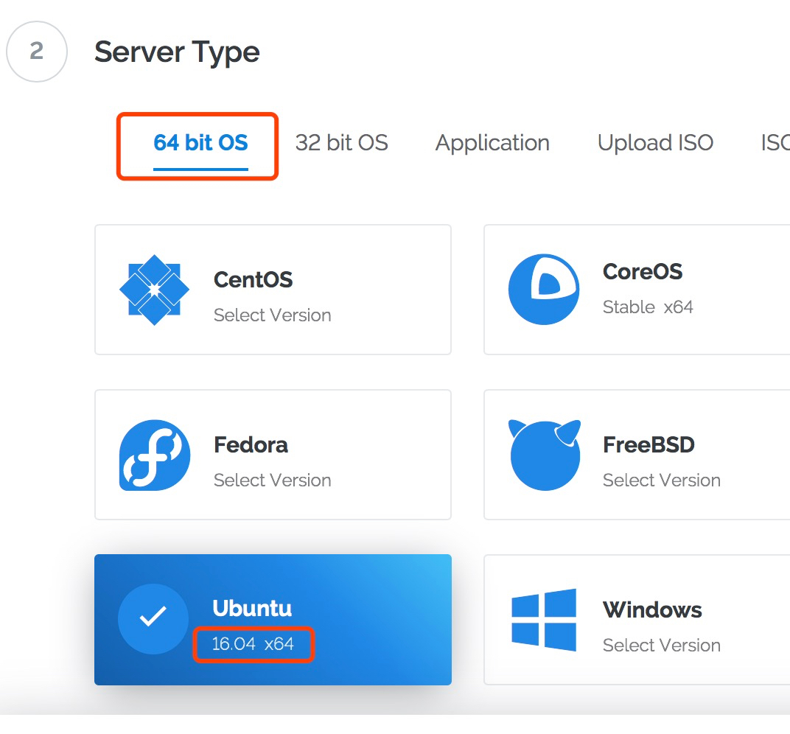
安装64位的Ubuntu，版本号16.04 x64。
> 别装错了，可能会有配置差异
4. Server size
反正我选两块五的，你们随意
5. Additional feature
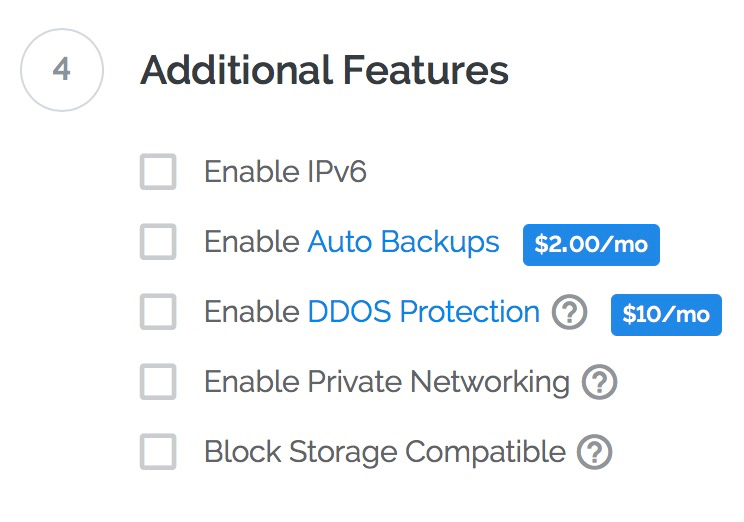
勾选Enable IPv6，其余默认

然后就可以点击“Deploy now”新建了，初始化几十秒后，可以在左侧“Sever”菜单里看到自己的服务器了。
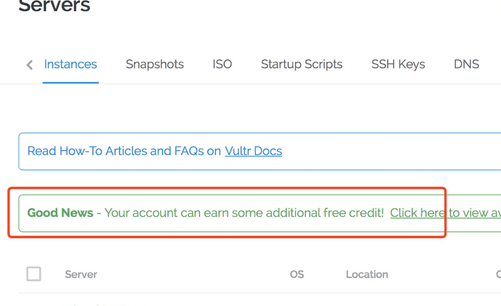
这个“Good news”就是之前说的Twitter分享赚3刀的活动。

点击自己的服务器，可以看到IP、用户名和密码

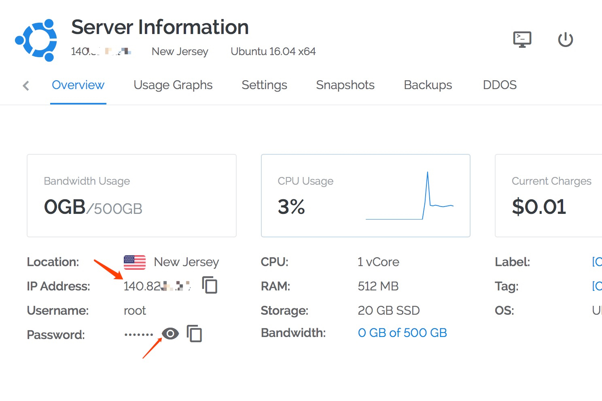

这个IP、用户名、密码是用来后续远程连接

OK，服务器新建完成！

## 2. 在服务器上安装shadowsocks服务

### 2.1 远程连接服务器

使用ssh协议连接，一般的iMac都预装了ssh。
> 我的操作环境是macOS iterm，windows可安装xshell连接，请自行百度方法

假设刚新建的服务器的IP是140.82.1.1, 用户是root，密码是1234

打开iterm，输入
```
ssh root@140.82.1.1
```
回复选yes，然后输入密码

如图显示表示成功连接
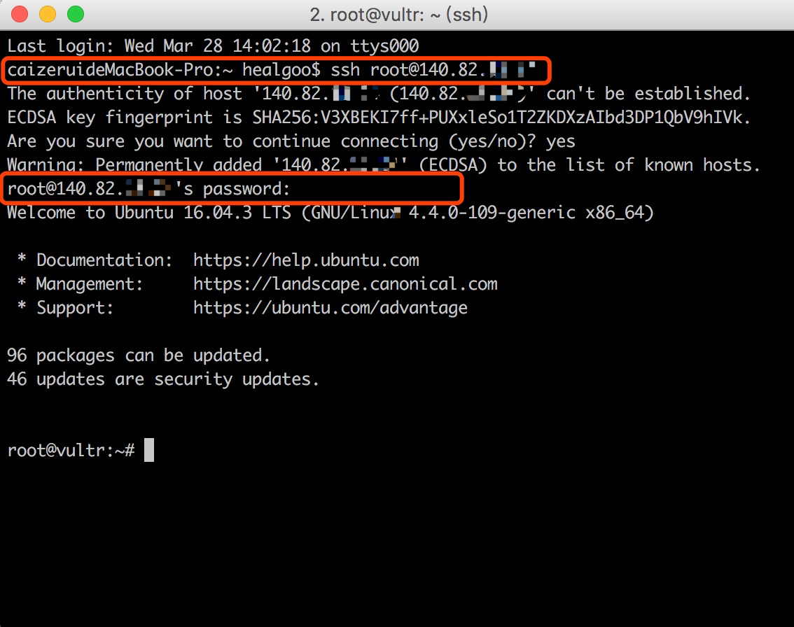


### 2.2 安装服务

接下来就是一阵复制粘贴操作猛如虎
> - 以下的步骤以root权限进行的（Vultr也默认是root用户），如果不是root，要添加 sudo 执行。

> - 可以使用 who am i 查看当前用户


```shell
# 更新软件源
apt-get update
# 安装pip环境
apt-get install python-pip
# 更新pip版本
pip install --upgrade pip
# 安装setuptools模块
pip install setuptools
# 安装shadowsocks
pip install shadowsocks
# 编辑配置文件
vim /etc/shadowsocks.json
```
在/etc/shadowsocks.json中添加
```json
{
    "server":"0.0.0.0",
    "server_port":1024,
    "local_address": "127.0.0.1",
    "local_port":1080,
    "password":"mypassword",
    "timeout":300,
    "method":"aes-256-cfb"
}
```
其中，password是你设置的shadowsocks连接密码，不需要和服务器密码一致。

继续操作
```shell
# 赋予shadowsocks配置文件权限
chmod 755 /etc/shadowsocks.json
# 安装以支持这些加密方式
apt-get install python-m2crypto
# 后台运行shadowsocks
ssserver -c /etc/shadowsocks.json -d start
# 设置shadowsocks开机自启动
vim /etc/rc.local
```
在exit 0前面加上shadowsocks的启动命令
```shell
# In order to enable or disable this script just change the execution
# bits.
#
# By default this script does nothing.
ssserver -c /etc/shadowsocks.json -d start
exit 0
```
## 3. 本地安装shadowsocks管理软件

### 3.1 下载shadowsocks

由于[shadowsocks官网](https://shadowsocks.org/en/download/clients.html)难以访问（原因你懂得），所以可以在[全球最大基友交友网站](https://github.com/shadowsocks)下载。

shadowsocks支持各桌面和移动系统，各版本如下：

> - Windows：shadowsocks-windows
> - Mac：shadowsocksX-NG
> - Linux：shadowsocks-qt5
> - Android：shadowsocks-android
> - iOS/苹果客户端直接在App Store里搜索shadowsock关键字（或者wingy关键字，FirstWingy可用 2018.03.25），软件经常被下架，我目前用的是Wingy & Shadowrocket，如果找不到，你也可以通过PP助手去下载Shadowrocket
### 3.2 配置服务器
这里讲下macOS、Android、ios的配置方法，其他桌面系统配置类似macOS。
1. macOS
    安装完成后，状态栏出现一个“飞机”的标志，点开进行如图配置：
    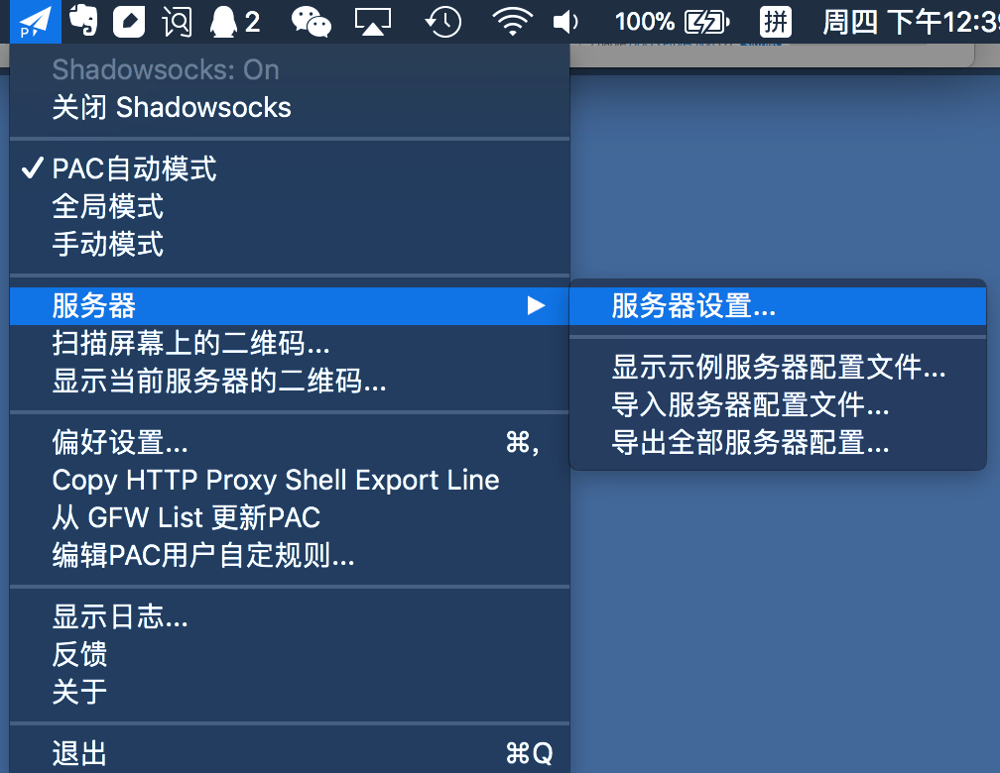
    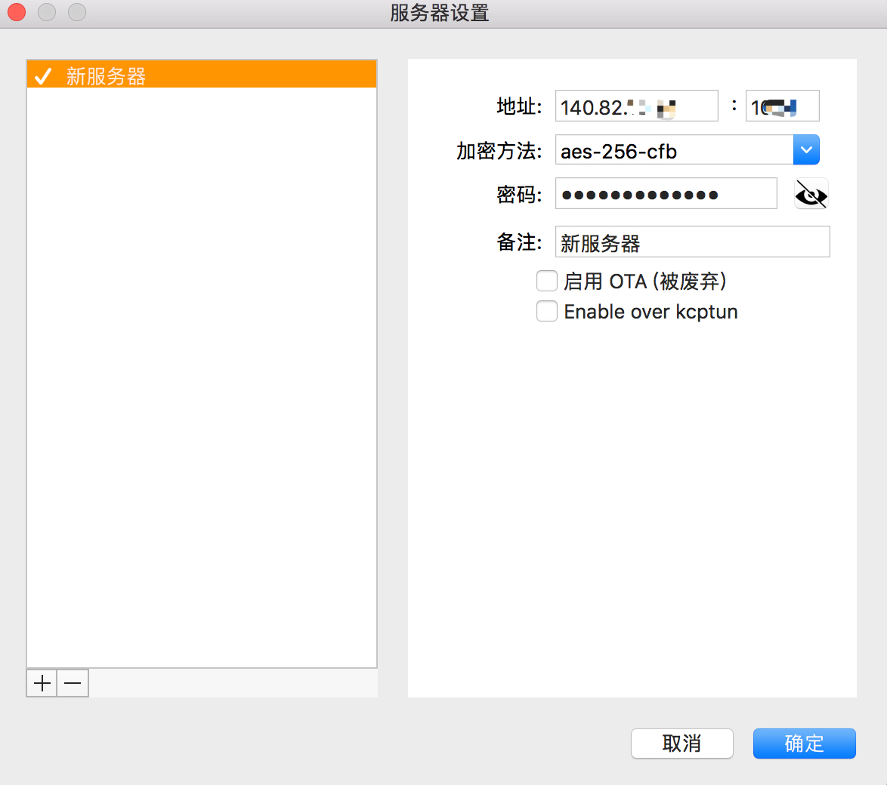
    地址、端口、加密方式、密码按照上文的 /etc/shadowsocks.json 配置文件填
    另外还可以根据自己需要勾选“PAC自动模式”和“全局模式”，以及在“偏好设置”中开启开机自启
    > + PAC自动模式：国内可以访问的站点直接访问，不能直接访问的再走shadowsocks代理，建议选择这种模式
    > + 全局模式：全局使用shadowsocks代理

    配置完成后，我们就可以开始做一些**不可言喻的事情**了

    

    额，不好意思放错图了，这张才是

    

2. Android

3. ios

### 3.3 开启BBR加速
BBR是Google开源的一套内核加速算法，可用于带宽加速（能不能看4K就靠你了）

在我们的Vultr服务器上，运行如下：
```shell
# 检查内核版本
uname -a
```
如果版本低于4.9，按照以下步骤先更新内核版本（root权限）
```shell
# 确定系统位数
getconf LONG_BIT
# 在http://kernel.ubuntu.com/~kernel-ppa/mainline/下载最新的程序包
wget http://kernel.ubuntu.com/~kernel-ppa/mainline/v4.10.2/linux-image-4.10.2-041002-generic_4.10.2-041002.201703120131_amd64.deb
# 切换到文件下载目录，执行下面的命令进行升级
dpkg -i linux-image-4.10.2-041002-generic_4.10.2-041002.201703120131_amd64.deb
# 更新grub引导
update-grub
# 重启
reboot
```
如果版本高于4.9，可直接安装BBR
```shell
# 修改系统变量
echo "net.core.default_qdisc=fq" >> /etc/sysctl.conf
echo "net.ipv4.tcp_congestion_control=bbr" >> /etc/sysctl.conf
# 如果执行以上命令时显示拒绝访问则可以尝试使用如下命令：
sudo bash -c 'echo "net.core.default_qdisc=fq" >> /etc/sysctl.conf'
sudo bash -c 'echo "net.ipv4.tcp_congestion_control=bbr" >> /etc/sysctl.conf'
# 保存
sysctl -p
# 查看是否开启成功
sysctl net.ipv4.tcp_available_congestion_control
# 返回结果为：et.ipv4.tcp_available_congestion_control = bbr cubic reno代表开启成功
```
安装过程如图：
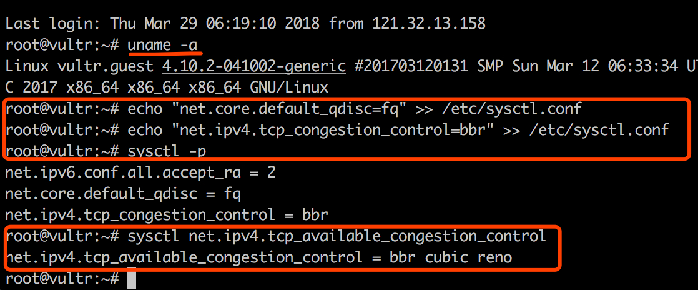
## 4. 多用户管理
有了这等利器，怎么能忍住不分享给女神？
> 我：在吗
  女神：要睡觉，88


> 我：等等！我有梯子！！可以翻墙！！！

多用户配置十分简单，同一个密码端口可以给不限数个终端使用，如果和女神之间没有私密可以直接连接一个端口（羞羞哒）

如果要分开使用，只需要将前文提到等服务器配置文件 /etc/shadowsocks.json 修改下（端口号可以自定义）：
```json
{
    "server": "0.0.0.0",
    "port_password": {
        "8381": "NvShenDeMiMa",
        "8382": "WoDeMiMa",
    },
    "local_address": "127.0.0.1",
    "local_port":1080,
    "timeout": 300,
    "method": "aes-256-cfb"
}
```
然后重启服务即可：
```shell
ssserver -c /etc/shadowsocks.json -d stop 
ssserver -c /etc/shadowsocks.json -d start
```
然后在本地shadowsocks软件的服务器配置那里按端口重新填入即可
## 5. IP被封怎么办——服务器快照迁移
既然是科学上网，自然IP有经常被封的情况发生

不要慌！

前面已经说过，Vultr提供快照迁移功能，灰常方便，如下操作即可

### 5.1 生成快照
进入[Vultr官网](https://my.vultr.com/)，在你的控制台左侧选择"Servers"，然后点击"Snapshot"，输入你的快照名，点击生成，耐心等待即可
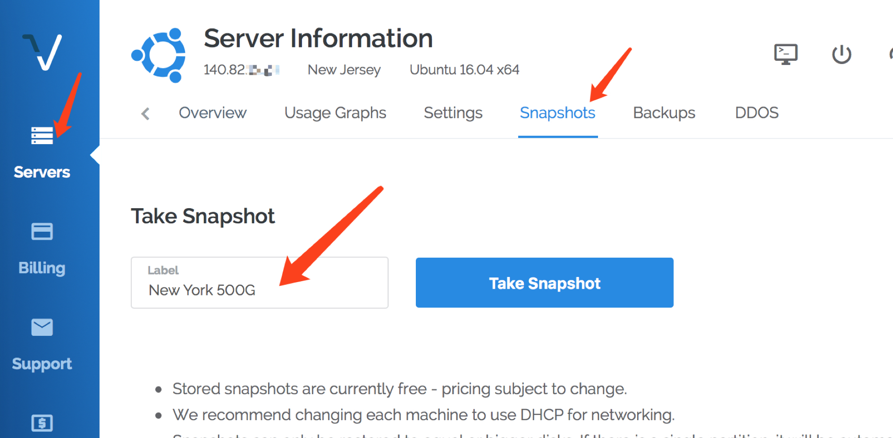

### 5.2 新建服务器
Destroy之前被封了的服务器
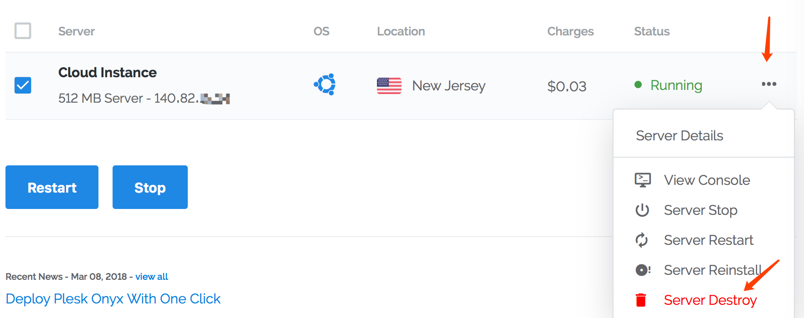
按之前的步骤重新新建服务器，唯一区别是在"server type"那里选择"Snapshot"
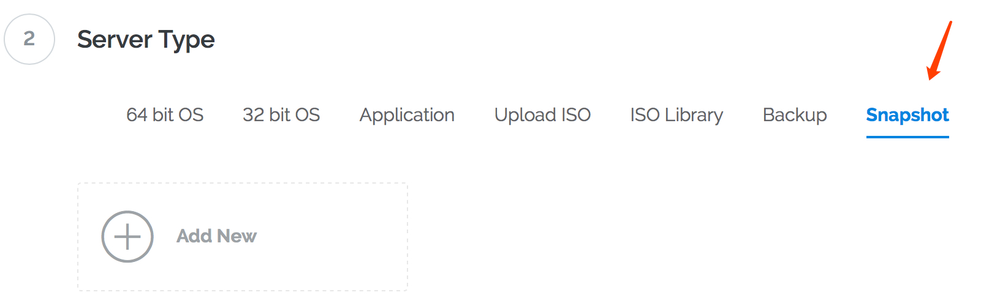
搞定后就是重新匹配一下shadowsocks的IP了，如果服务器上部署了自己的一些应用（如博客），也都需要修改一下IP指向。


---
写完啦～

---
**转载请附带以下内容：**

***Author:*** Leoch

***首发Blog:*** [leoch.xyz](http://leoch.xyz)

***Inspired by:***  [flyzy小站](https://www.flyzy2005.com) ，plz refer to it for more information.

---